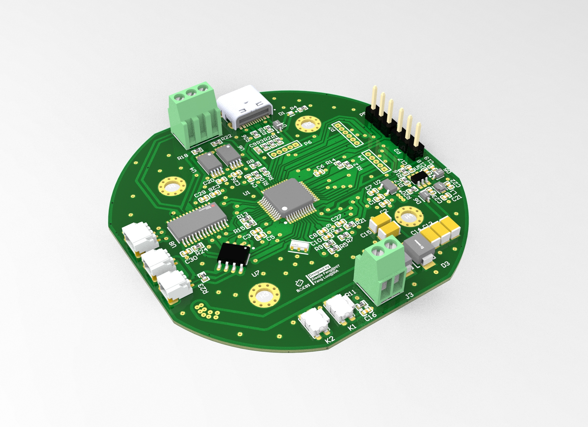
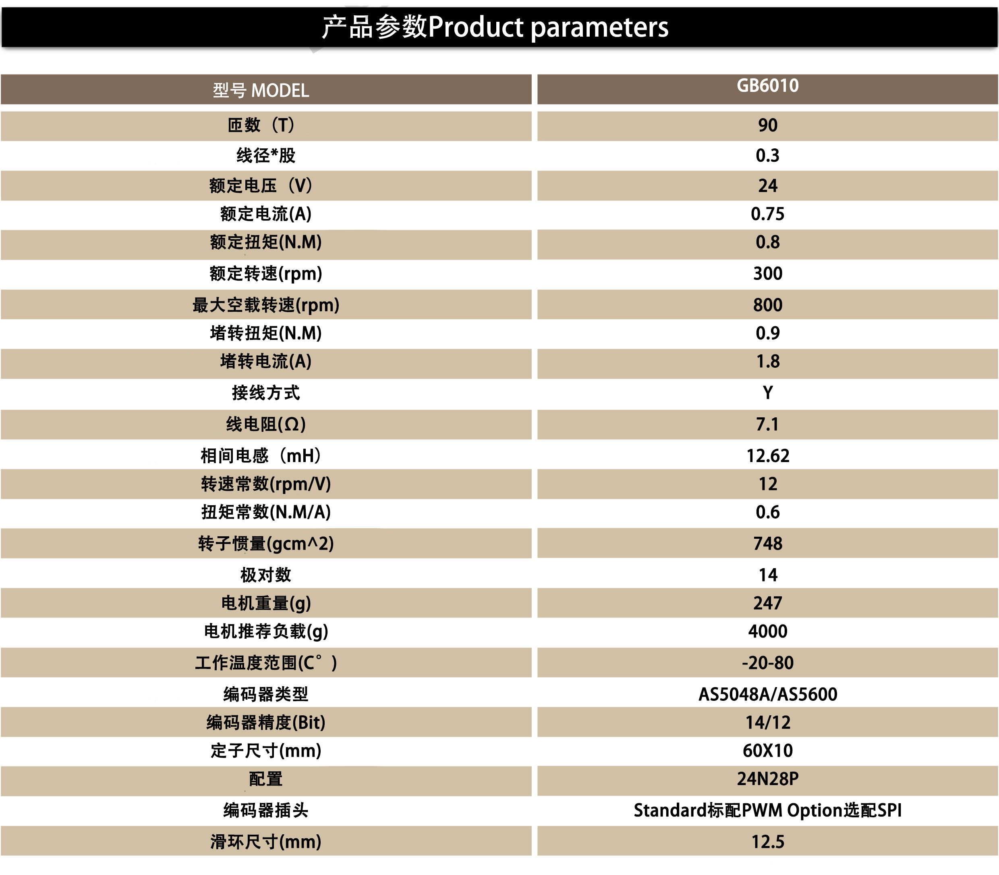
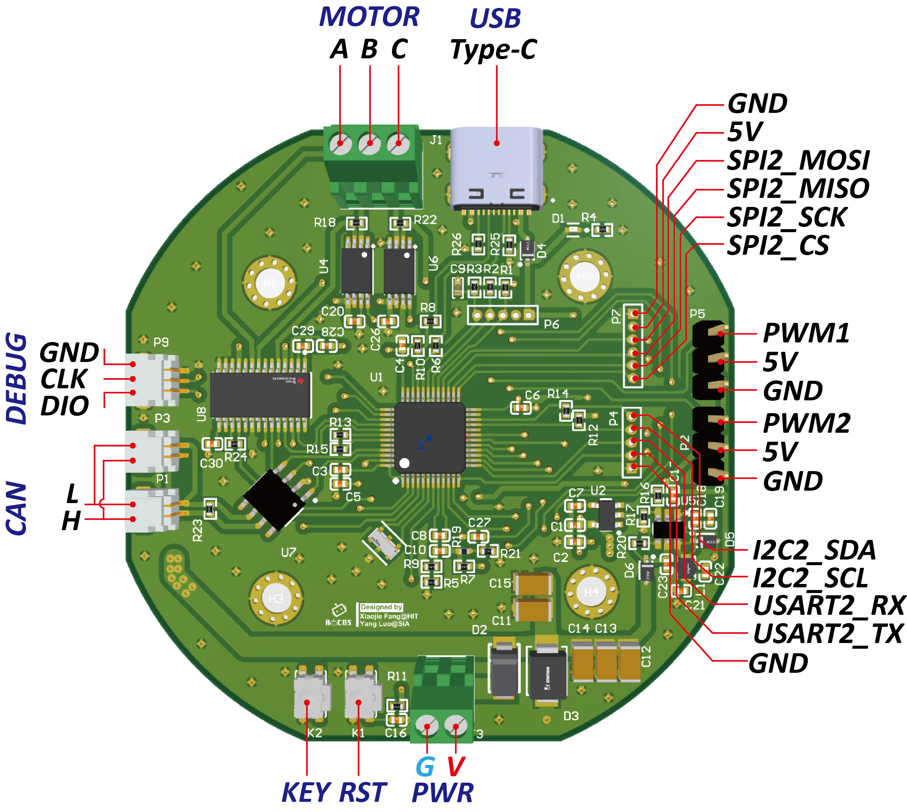

# ROCOS FOC *for Motor Control*

:warning:这是一个FOC驱动器项目，目前正在开发中~



驱动器采用的方案：

- **电机**：[GB6010云台电机](https://item.taobao.com/item.htm?spm=a1z0d.7625083.1998302264.6.5c5f4e6900plQJ&id=639378697535)，14对极，具体参数如下：


- **主控**：STM32F103CBT6
- **位置传感器**：AS5048A，SPI接口
- **驱动**：DRV8313
- **电流传感器**：INA240，线上检测（增益50V/V，采样电阻0.01R）

## 接口及尺寸定义

驱动器可以直接安装在电机尾部（电机尾部自带一块径向充磁的磁铁，AS5048A正对磁铁）


接口方面主要包括：

- USB-C接口（16pin）
- 电机三相接口，KF128-3p
- 电源接口， KF128-2p
- SW调试口， SH1.0-3p
- CAN总线接口，SH1.0-2p

其余引脚通过插针引出使用，具体见下图：



## 文件夹结构

```bash
Rocos-FOC
 ├── Firmware 驱动器固件代码
       ├── HAL_Version 基于STM32CubeMX和HAL库版本
       └── Platformio_Version 基于Platformio及Arduino版本
 ├── Hardware 硬件设计（原理图和PCB）
 ├── Model 驱动器三维模型Keyshots渲染文件
 ├── Docs  相关资料文档
 └── Utils 相关实用工具

```


## 参考

- [SimpleFOClibrary - Simple Field Oriented Control (FOC) library](https://github.com/simplefoc/Arduino-FOC)
- [Ctrl-FOC-Lite评估套件](https://github.com/peng-zhihui/Ctrl-FOC-Lite)
- [灯哥开源FOC双路无刷电机控制器](https://github.com/ToanTech/Deng-s-foc-controller)
- [dgm 电机驱动器简介](https://github.com/codenocold/dgm)
- [ODrive](https://github.com/odriverobotics/ODrive)